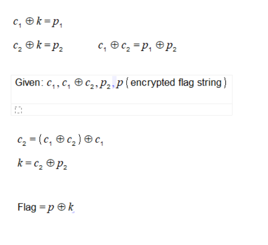

# A little bit of XOR

Author: Adarsh Kishore <br/>
Flag: <code>ctf{@_b1t_0f_X0R}</code>

## Problem Statement

Rox has encrypted our secret `F` with a integer key `k` and has left us with `0010010 10000101 10010111 10001010 10110001 10101110 10010011 11000000 10000101 10101110 11000001 10010111 10101110 10101001 11000001 10100011 10001100`. Fortunately (or unfortunately ?), the key k was also used to encrypt `c` resulting in ```10010111 10011110 10000011 11011100 10101110 10010000 10011101 10011101```.
Rox obtained `c` by applying a special operation on ```110010 11101 10111 1001100 101100 10100 11110 1001``` and a Treasure.

Can you please obtain our secret `F`

## Hint

1. The Treasure is literally the Treasure
2. Same encryption technique was used in all the steps

## Solution
This problem works on the basis of the XOR cipher. As we know, XOR is
a bitwise operation that returns 0 when both operands are same and 1
otherwise. A remarkable feature of XOR is that it is it's own inverse.
This makes it suitable for encrypting and decrypting messages, but
since it is a symmetric key cryptography, it can also be cracked if the
same key is used repeatedly.

For this, suppose that c1 and c2 are two messages which are encrypted
into p1 and p2 by the same key k. Then since c1^k=p1 and c2^k=p2,
implies that c1^c2=p1^p2. By suitable analysis in byte changes,
since p1 and p2 are known, c1 and c2 can be guessed and found.

The problem exploits this feature only. We are given c1^c2, p2 and an
encrypted string p. The same key is used to encrypt c1, c2 and
decrypt p. There's a hint in the wording of the problem to guess c1.
From this c2 can be found and hence the key k. This can then be used
to decrypt p which gets the flag.



A complete solution is given in the [code](./xor.py).
