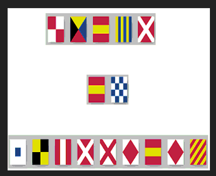

# Who is attacking?

Author: Dibyam Kumar

Flag: `CTF{CH1N4_1S_AT74CK1NG}`

## Problem Statement

the ~~international~~ french ~~space~~ water station was broadcasting a secret message to its headquarters. since the message was being broadcasted very Slowly, someone Scanned the message using their very old TeleVision but all they could hear were some distorted noises.....

Submit after enclosing inside CTF{} and separate the words with an underscore ( _ ) 

## Hints

 does the key open the cAsE, or does the cAsE open the key?

## Relevant files / links

- [radio-signal.wav](https://drive.google.com/file/d/1ZFc7sx_bNt3vJ_8KZW9n_M-bysNC2SsC/view?usp=sharing)

## Solution

Proposed Difficult Level : Medium

- The question is somewhat revealing. The words slow , scan , and TV are a part of the question statement. Searching these on some online search engine will lead to articles about SSTV. 

- After decoding the SSTV signal, the participant will get the following image

- 

- These are Maritime Signal flags, each corresponding to some character. These can by easily decoded using some online decoder. 

- Every line corresponds to a word. `UZ1G4` , `1N`, `SL74VF1FY` respectively. After concatenating them with an underscore , we get
`UZ1G4_1N_SL74VF1FY`

- This text has been encoded using the Vigenere Cipher using `SSTV` as the Key.(When you pick up the only uppercases letters in the description, you get SSTV. The cases used in the problem statement are intentional, supported by the Hint)
Also, the keyword `french` in the problem desription hints at the use of Vigenere Cipher.

- After decoding the above Vigenere ciphertext using `SSTV` as the key, the flag is revealed - `CH1N4_1S_AT74CK1NG`

