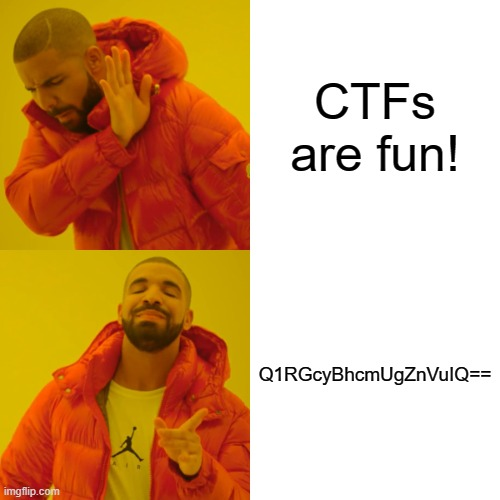

# What's The Fact?!

Author: [Pratik Jallan](https://www.linkedin.com/in/pratik-jallan-yukino2002/)

Flag: `CTF{TheWorldIsaCruelPlace}`

## Problem Statement

In an alternate Earth, where the humans could only perceive the colour Blue, was a small village with 126 people.
Unlike normal humans, they could only communicate in '46B', a language known only to their kind. 
The way they wrote this language was unique as well. They used binary to represent their characters. 
One merry night, all the villagers stood in A Single Row, and started shouting numbers. One person keeping track of it, either wrote a '1' or a '0' depending on his liking of the number. 
Unintentionally, the number when translated to '46B' turned out to be a well known fact of this world.

Can you find out the fact making use of the file given? The answer format is CTF{fact}, the fact exactly in the same format as obtained, no spaces.

## Relevant files / links

- 
- [Google Drive link](https://drive.google.com/file/d/1W5-HwIR-Momfj1Rx6OQXyBqLZm801IYy/view?usp=sharing)

## Hint

1. The simple meme might be hiding more than what is visible at first glance...
2. The likability of that certain person might have something to do with a certain number's divisibility...

## Solution

The problem primarily involves `Image Steganography` and elementary use of `Base64` encoding-decoding. Steganography is a method of hiding secret data, by embedding it into some file, in this case, an image. It is one of the methods employed to protect secret or sensitive data from malicious attacks.

We know that an image is nothing but a matrix of pixel intensities. As this is a coloured image, it is made up of 3 channels `(RGB)` as opposed to a grayscale one. In image steganography, we modify these pixel values to encrypt or hide our message, at the same time ensuring that there is no noticeable change made to the image. It is such an effective approach that if not provided with the original image alongside the `stego image`, one might not even notice any change.

So, the image is clear indication of the involvement of Base64, the two equal signs at the end give it away. The description begins with providing us the hint that only the colour `Blue` was important among all the three channels. Next, it provides us with the number `126`, which will come in use later. The next hint is the representation of characters using binary, this is where Base64 will come into play when decoding. `46B` is just B64 in reverse, stupid name.

The statement `all the villagers stood in A Single Row` indicates a single row with 126 columns. The next line `either wrote a '1' or a '0'` indicates that all the numbers must be replaced with a 1 or 0, that is, a binary string based on the condition whether the number is even or odd. An even number must be replaced by 0 while an odd number must be replaced with 1.

Since no particular information about the row number has been given, the `flag is kept at the very beginning of the matrix`. After calculating the binary string, we must apply `Base64 decoding on groups of 6 bits at a time`. This will give us the flag!

The complete python encoding file along with the solution and original images for the same have been included.

- [Encoding](./Encoding.py)
- [Solution](./Solution.py)
