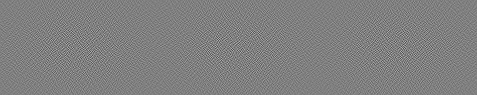
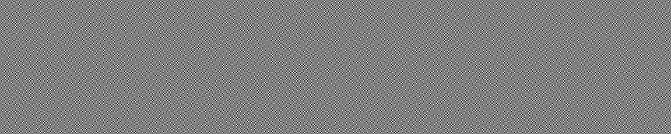
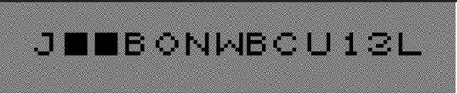

# Heavens and Earth

Author: Dibyam Kumar

Flag: `CTF{J01N_W3B_CLUB}`

## Problem Statement

The Heavens and the Earth had finally met, and the Angels were finally going to reveal to mankind their purpose. But oh god! A car in 3rd gear broke the railfence, and hit the train the Angels had arrived on (Wait What!?). The heavens and the earth separated again...

Oh, by the way, I swear I did not hide anything in the image

Enwrap the words inside CTF{} and use underscore as the separator. 

## Relevant files / links

- [Heavens and Earth](https://drive.google.com/file/d/1Q8UOTnAJXEtspg5XGNALrcvbhmO7QV4_/view?usp=sharing)

## Hints
 
- Are you sure that you want to ignore the dots? 

## Solution

This challenge involves Visual Cryptography and RailFence cipher. 

- The line` Oh, by the way, I swear I did not hide anything in the image` is obviously  suspicious. There is a zip file hidden inside the jpg using the windows `copy` command. The same zip file can be retrieved by either using `binwalk` or opening the `jpg` after changing its extension to `rar` or `zip`.

- The zip file, upon extraction, yields  two images - [heavens.png](https://drive.google.com/file/d/1-6UmRy95N5GO25Fq7jP52_8rTOjydL_h/view?usp=sharing) and [earth.png](https://drive.google.com/file/d/1AN_ptcahi8AFQmeAxI9MKjmICCmWKKlD/view?usp=sharing). 

- heavens.png

- earth.png

- There is a mention of the heavens and earth meeting in the problem statement. This is what is to be done, make the heavens and the earth meet. In this context, it implies superimposing both the images. (The best way to do this is to use some photo editing software like photoshop, add the two images as two layers over each other, and set the `blending mode` to `Darken`. Online tools can also be used. )

- After superimposing the two images, we get the following image with the text - `J··B0NWBCU13L`

- 

- There is another mention of a `car in 3rd gear hitting a railfence`. This hints towards the use of Railfence cipher with 3 rails. 

- Finally, using any Railfence decoder with number of rails/rows/levels set to 3, the above ciphertext can be decoded and the following text is generated - `J01N·W3B·CLUB`. This will only be generated if the participant uses the two dots in the ciphertext. Hence the hint

- Finally, the dots can be replaced with underscores and the following flag can be submitted - `CTF{J01N_W3B_CLUB}`
