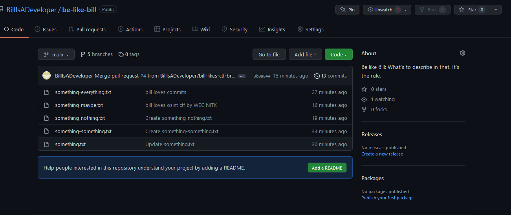
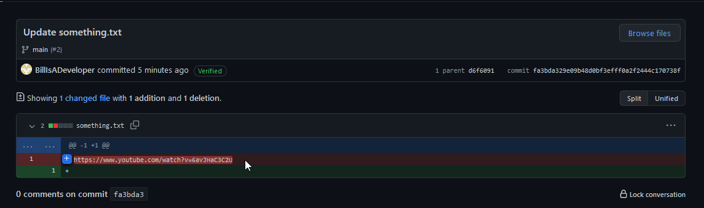
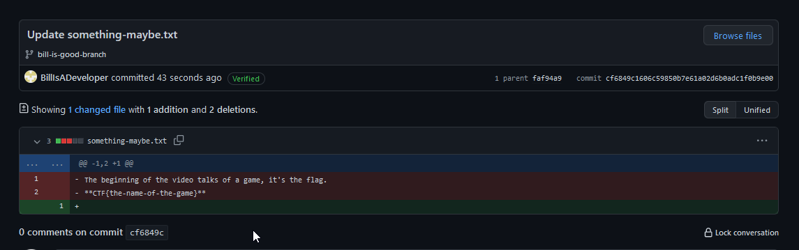
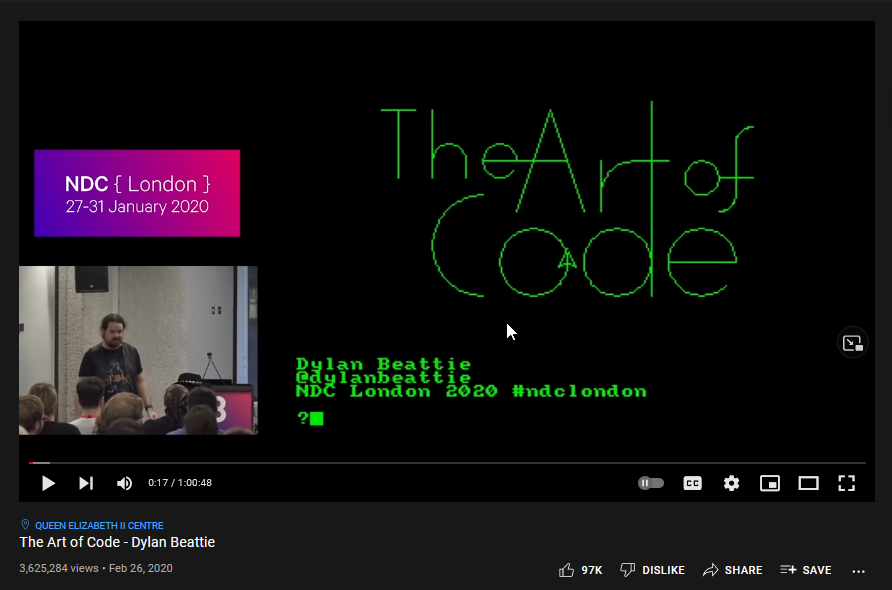

# **Be-Like-Bill :)**

Author: [Sujant Kumar Kv](https://github.com/sujantkumarkv)

Flag: `CTF{game-of-life}`

## **Problem statement**

Answer: CTF{X} ?

Hint:
- X to be filled in is the name of whatever answer you get.

## Solution

The problem relies on meme's words and enough hint to look for Bill's profile. A general search helps but we also notice since he's a developer, we look into github and find him [here](https://github.com/BillIsADeveloper/).

As we can see it has many branches. They have files with nothing in them.
Commit messages like 'bill loves commits' hints towards commit history and as we look into, 

some are empty and some have content in history where we get help.
We get the hints to look into the youtube link where we get the flag.

On looking for the video in the commit history,

The beginning part itself talks about **"The John Conway Game of Life"**.

### Hence, the flag: CTF{game-of-life}

