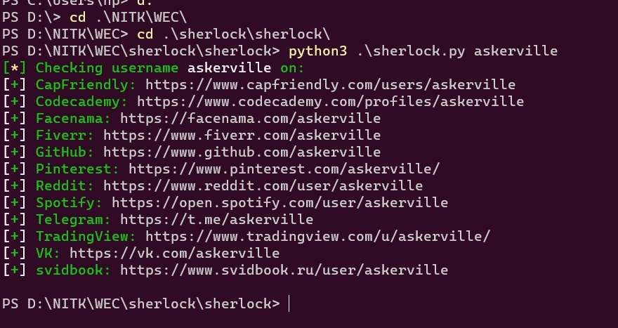
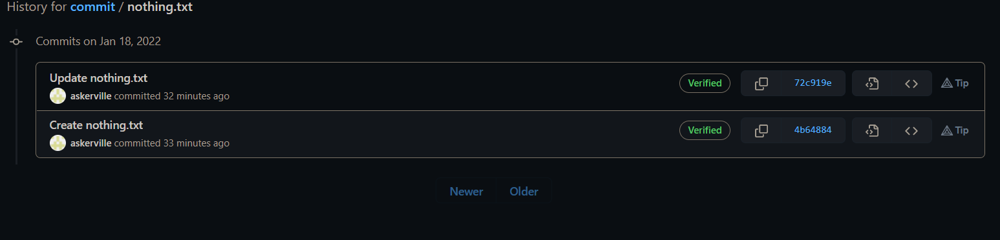
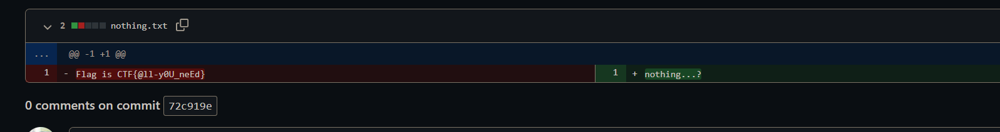

# Detective

Author: Adarsh Kishore  
Flag: `CTF{@ll-y0U_neEd}`

## Problem Statement
Sir Arthur wrote the Hound of B____

## Hint
1. There were two people, Watson and ?
2. Fill in the blanks :)

## Solution
This problem relies on the Open Source Software called Sherlock which is
available as the Python script
[here](https://github.com/sherlock-project/sherlock). Use this to search for
askerville

We note the username on GitHub, which is a fake profile I created. It has a
single repository called [commit](https://github.com/askerville/commit). It has
six branches, all of which have a README.md and a nothing.txt. In branch br4,

if we view the commit history of nothing.txt

and open it to view changes

we get the flag.
