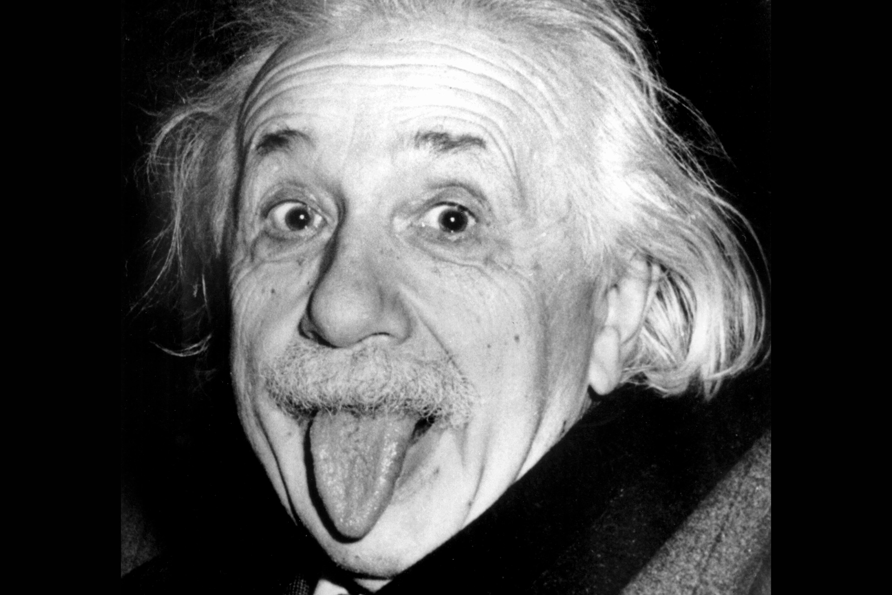

# Tongues and Relativity

Author: Adarsh Kishore  
Flag: <code>CTF{ThE0ry_oF_Rel@t1vIy}</code>

## Problem Statement

Someone pulled out their tongue with Frank-ness. Ah, those happier
photos will never come back again, only in the rarest of hashtags(which i am sure will annoy you till you get it right) can
it be found!

## Hint

1. Frank-ness is not a typo. And he was not alone when this happened.       
2. rarest of hashtags - search for a hashtag relevant to ctf and the person

## Solution

Here relativity clearly hints towards Albert Einstein, and
tongue refers to his iconic photograph by the paparazzi that has become
famous.

This photo was clicked on March 14th, 1951. It was the birthday of
Einstein and he had gone to Princeton university. He was with Prof.
Frank at the time, who was the then head of university.

There are several tools to search for hashtags. But photos are generally associated with Instagram & searching for #albertctf would lead to the flag in the comment of the post.

   

