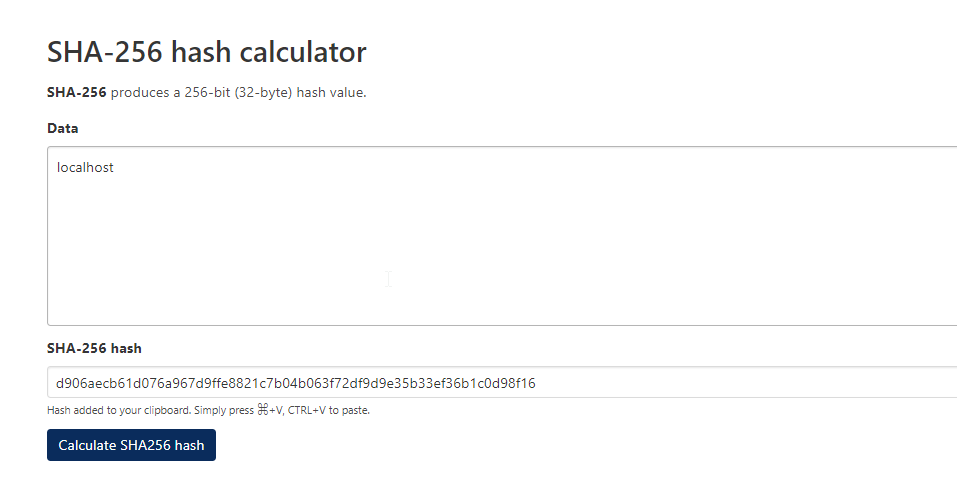
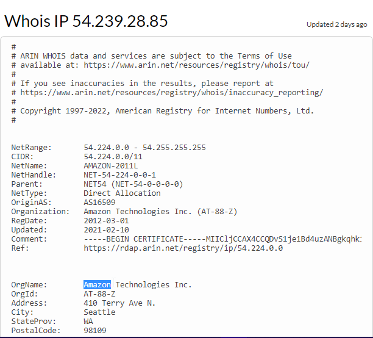

# **X and Y**

Author: [Sujant Kumar Kv](https://github.com/sujantkumarkv)

Flag: `CTF{amazon}`

## **Problem statement**

*Technology* and *daily services* built out of it daily evolved because it was *secure* for users.

127.0.0.1 <--> X <--> 49960de5880e8c687434170f6476605b8fe4aeb9a28632c7995cf3ba831d9763

54.239.28.85 <--> Y <--> 77589d4e82c0d5dd2e1cc40e6375b1b11fadaaa2fb9b01c828739e8337292069

Answer: CTF{ Y } ?

## Hint
- Maths loves the *hash* symbol just like Bitcoiners love the *bitcoin* symbol.
- Fill in the blank ;)

## Solution

The problem relies on two simple yet important stacks of technology.

- IP
- Cryptographic Hashing

127.0.0.1 is an IP address and is expected to be known as the **localhost** and a quick search would give the same. 

The hints provided tells about the *hash* , *security*, *bitcoin*, *maths* which tells the hashing algorithm of bitcoin.

Searching for it tells us it's : SHA256. There are many OS tools for SHA256 calculation, one such [here](https://xorbin.com/tools/sha256-hash-calculator), hashing "localhost" results in the exact long string given in the question. 

The other IP address' details can be looked [here](https://www.whois.com/whois/54.239.28.85). Just like 127.0.0.1 implies - *localhost*, this points to it's owner *amazon*. The question already hints at *daily services* similar to possible answer, 'amazon' and hashing "amazon" gives us the value and we confirm it with the given hash in the question.

### Thus the answer: CTF{amazon}
and we get our flag :)
